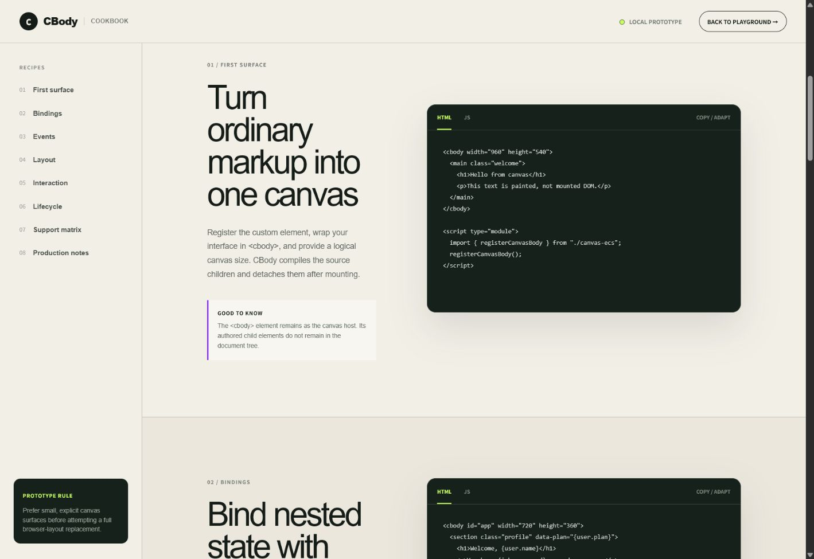

# CBody

**Write HTML, CSS, and JavaScript. Render the final interface on one canvas.**

CBody is an experimental canvas UI runtime with a DOM-shaped authoring model.
Place familiar markup inside `<cbody>`, bind state with `{property.paths}`, and
let the runtime compile the source into an entity-component-system (ECS) world.
After compilation, the authored child elements are detached and the visible
interface is painted onto a high-DPI `<canvas>`.

> CBody is currently a framework prototype, not a complete browser engine or a
> published npm package. It is intended for exploring the architecture, API,
> performance model, and developer experience.



## What the prototype demonstrates

- A `<cbody>` authoring element backed by an internal standards-compliant
  `<c-body>` custom element.
- Source element compilation followed by DOM detachment.
- Deeply reactive state exposed through `cbody.data`.
- `{path}` interpolation in direct text and attributes.
- ECS component stores for tree, binding, style, and layout data.
- Independent binding, style, layout, input, and render systems.
- Block flow plus a focused subset of flexbox.
- Canvas pointer hit-testing, hover states, cursor updates, and click dispatch.
- Standard inline click handlers such as `onclick="counter.add()"`.
- Device-pixel-ratio-aware rendering.
- Runtime events for render and pointer instrumentation.

## Mental model

```text
HTML + CSS + JavaScript
          │
          ▼
  <cbody> compiler
          │
          ▼
┌───────────────────────────────┐
│ Entity-component-system world│
│                               │
│ Tree · Binding · Style · Layout
└───────────────────────────────┘
          │
          ▼
 Binding → Style → Layout → Render
                 ▲
              Input
          │
          ▼
     One visible canvas
```

The detached source elements are still retained by the ECS tree component.
This allows the input system to dispatch a normal `MouseEvent` to the original
element and preserve its event handler without visually rendering that element
in the document.

## Run locally

Requirements:

- Node.js 22.13 or newer.
- npm.

```bash
npm install
npm run dev
```

Open:

- Playground: `http://localhost:3000/`
- Cookbook: `http://localhost:3000/cookbook`
- LumaFrame motion editor: `http://localhost:3000/editor`

If port 3000 is occupied, the development server prints the next available
local URL.

The LumaFrame editor can export a 1280×720 WebM video, a PNG frame, and a
portable `.lumaframe` project file. Project files embed uploaded media and can
be reopened with the editor's **Open project** control.

## First canvas surface

Register the custom element before using the runtime:

```ts
import { registerCanvasBody } from "./canvas-ecs";

registerCanvasBody();
```

Call it after the authored `<cbody>` exists in the document. When inserting
markup dynamically, pass its container to upgrade it synchronously:

```js
preview.innerHTML = "<cbody>...</cbody>";
registerCanvasBody(preview);

const app = preview.querySelector("cbody");
app.data = { count: 0 };
```

Author the interface with ordinary markup:

```html
<cbody id="app" width="960" height="540">
  <style>
    .welcome {
      width: 960px;
      height: 540px;
      padding: 32px;
      color: #f2efe7;
      background: #17211b;
    }

    .action {
      width: 160px;
      height: 48px;
      border: 0;
      border-radius: 12px;
      color: #17211b;
      background: #c8ff62;
      cursor: pointer;
    }

    .action:hover {
      background: #d9d2ff;
    }
  </style>

  <main class="welcome">
    <h1>Hello, {user.name}</h1>
    <p>Count: {count}</p>
    <button class="action" onclick="counter.add()">
      Increment
    </button>
  </main>
</cbody>
```

Assign initial state and expose the action used by the markup:

```js
const app = document.querySelector("#app");

app.data = {
  user: { name: "Maya" },
  count: 0
};

window.counter = {
  add() {
    app.data.count++;
  }
};
```

Nested state is reactive. Updating `app.data.user.name` or
`app.data.count` schedules a new frame automatically.

## Binding rules

Bindings use property paths:

```html
<h1>{user.profile.name}</h1>
<p data-plan="{user.plan}">{inbox.unread} unread</p>
```

```js
app.data = {
  user: {
    profile: { name: "Maya" },
    plan: "studio"
  },
  inbox: { unread: 4 }
};
```

The prototype intentionally does not evaluate arbitrary expressions inside
braces. Compute derived values in application state:

```js
app.data = {
  firstName: "Maya",
  lastName: "Chen",
  displayName: "Maya Chen"
};
```

## Runtime API

### `registerCanvasBody()`

Defines the internal `<c-body>` custom element and synchronously upgrades every
authored `<cbody>` element on the page. Calling it again is safe.

Custom-element registry names are required by the browser to contain a hyphen,
so `customElements.define("cbody", ...)` is invalid. CBody preserves the cleaner
public `<cbody>` syntax through a compatibility wrapper while using `<c-body>`
internally.

### `cbody.data`

Gets or replaces the reactive data model:

```js
app.data = { count: 0 };
app.data.count++;
```

Objects nested inside the model are wrapped lazily in proxies.

### `cbody.invalidate()`

Schedules a frame manually. Use this when integrating state that does not live
inside `cbody.data`:

```js
externalStore.subscribe(() => app.invalidate());
```

### `cbody:render`

Emitted after a frame has completed:

```js
app.addEventListener("cbody:render", (event) => {
  console.log({
    entities: event.detail.entities,
    painted: event.detail.rendered,
    culled: event.detail.culled
  });
});
```

### `cbody:click`

Emitted after the hit-tested source element receives its click event:

```js
app.addEventListener("cbody:click", (event) => {
  console.log(event.detail.element);
});
```

## ECS architecture

Each compiled element receives a numeric entity identifier. Component data is
stored in maps instead of behavior-heavy objects.

| Component | Responsibility |
| --- | --- |
| `Tree` | Detached source element, parent entity, and child entities |
| `Binding` | Original direct-text template and bound attributes |
| `Style` | Resolved canvas-compatible visual and layout properties |
| `Layout` | Numeric position, dimensions, and content box |
| `Visibility` | Viewport intersection, subtree bounds, and subtree size |

The frame pipeline is split into systems:

| System | Work performed |
| --- | --- |
| `BindingSystem` | Resolves `{paths}` and updates detached source values |
| `StyleSystem` | Matches CSS rules, inline styles, and the hovered entity |
| `LayoutSystem` | Calculates block/flex boxes in logical canvas coordinates |
| `VisibilitySystem` | Marks visible entities and rolls up subtree bounds |
| `InputSystem` | Hit-tests pointers and dispatches source-element events |
| `RenderSystem` | Paints backgrounds, borders, and wrapped text |

This separation is the basis for future dirty-component queries. The current
prototype runs the main systems for every invalidated frame to keep the first
implementation easy to inspect.

## Offscreen rendering strategy

CBody uses two levels of visibility optimization.

### 1. Suspend an offscreen canvas host

An `IntersectionObserver` watches the internal `<c-body>` host. When the canvas
is completely outside the browser viewport:

- scheduled animation frames are cancelled;
- state mutations are retained;
- binding, style, layout, visibility, and paint systems do not run;
- one pending frame is scheduled when the host becomes visible again.

This prevents canvas applications far above or below the page viewport from
consuming frame time during long-page or “doom scrolling.”

### 2. Cull entities outside the visible canvas region

When part or all of the canvas is visible, `VisibilitySystem` compares every
entity's layout box with the visible logical-canvas rectangle. It also rolls
child bounds into each parent so an entirely offscreen subtree can be rejected
with one check.

The renderer skips:

- background and border painting;
- text measurement, wrapping, and painting;
- descendant traversal when the whole subtree is outside the viewport.

Pointer hit-testing ignores culled entities as well.

Use `overscan` to paint a small area beyond the visible rectangle and avoid
pop-in during fast scrolling:

```html
<cbody width="960" height="540" overscan="48">
  <!-- application -->
</cbody>
```

The default overscan is 32 logical canvas pixels. Set it to `0` for strict
culling or increase it for aggressively scrolling interfaces.

Layout still runs for entities inside an active canvas because their positions
are needed to determine visibility. A future virtual-list system can skip
layout for fixed-size offscreen rows by calculating their positions from an
item index instead of creating every row entity.

## Supported CSS subset

| Area | Current support |
| --- | --- |
| Layout | `display`, block flow, flex row/column, grow, gap, alignment |
| Size | `width`, `height`, percentages, logical canvas pixels |
| Position | static and basic absolute positioning with `left`/`top` |
| Spacing | `padding`, `margin`, `gap` |
| Boxes | background colors, borders, radius, opacity |
| Type | family, size, weight, line height, alignment, case conversion |
| Interaction | `:hover` and `cursor` |

Use explicit dimensions for important containers while the layout engine is
still evolving. CSS gradients, grid, transforms, filters, overflow behavior,
and the full cascade are not implemented.

## Input and event flow

```text
Pointer event on canvas
        ↓
Convert browser pixels to logical canvas coordinates
        ↓
Reverse-order ECS layout hit test
        ↓
Find deepest matching entity
        ↓
Dispatch MouseEvent to its detached source element
        ↓
Application handler updates reactive data
        ↓
Schedule and paint the next frame
```

## Project structure

```text
app/
├── canvas-ecs.ts          # Custom element, world, components, and systems
├── framework-demo.tsx     # Interactive canvas playground
├── cookbook/
│   └── page.tsx           # Copyable usage recipes
├── globals.css            # Playground and cookbook presentation
├── layout.tsx             # Site metadata and shared document layout
└── page.tsx               # Main framework page

public/
├── cbody-cookbook.png     # README cookbook screenshot
└── og-cbody.png           # Social preview artwork
```

## Scripts

```bash
npm run dev       # Start the local development server
npm run build     # Create the production build
npm run lint      # Run ESLint
npm test          # Build and test server-rendered output
```

## Current limitations

- No accessibility or semantic-control mirror yet.
- No keyboard focus system.
- No text selection, editing, or complex script shaping.
- No form-control renderer.
- No image or video component in the general framework runtime.
- No CSS grid, transforms, animations, or complete selector/cascade model.
- Text measurement and layout are recalculated rather than incrementally cached.
- Inline handler bridging currently expects actions accessible from `window`.
- The runtime is source code inside this project, not a versioned library package.

## Recommended next milestones

1. Add an accessibility mirror with focus and keyboard navigation.
2. Introduce dirty flags and ECS queries for incremental system execution.
3. Build a measured text engine with font-loading invalidation.
4. Add image, video, input, and editable-text components.
5. Move layout and painting to an `OffscreenCanvas` worker.
6. Extract the runtime into a standalone package with tests and examples.

## Cookbook

The local `/cookbook` page contains visual, copyable recipes for:

1. Creating the first canvas surface.
2. Binding nested reactive state.
3. Dispatching familiar click handlers.
4. Building block and flex layouts.
5. Painting hover feedback.
6. Observing lifecycle events.
7. Understanding the support boundary.
8. Planning production milestones.

Start the development server and open `/cookbook` for the complete guide.
